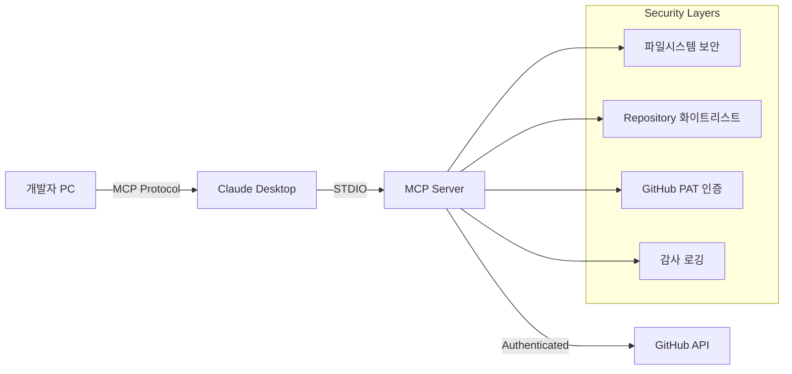

# 📊 프로젝트 진행 상황 (Project Status)

## 📅 마지막 업데이트: 2025-01-04

## 🎯 프로젝트 개요

**Code AI MCP Server (Node.js)** - TypeScript와 Node.js로 구현된 고성능 MCP(Model Context Protocol) 서버로, 코드베이스 분석 및 AI 통합 기능을 제공합니다.

### 주요 목표
- ✅ Spring Boot + Kotlin 구현을 TypeScript + Node.js로 마이그레이션
- ✅ 사내 개발자를 위한 보안 강화
- ⏳ AWS 기반 엔터프라이즈 배포
- ⏳ GitHub 외부 저장소 접근 제어

## 🏗️ 아키텍처 결정사항

### 1. **기술 스택 선택**

| 기술 | 선택 | 이유 |
|------|------|------|
| **런타임** | Node.js 18+ | MCP SDK 네이티브 지원 |
| **언어** | TypeScript | 타입 안전성, 개발 생산성 |
| **MCP SDK** | @modelcontextprotocol/sdk | 공식 SDK, Claude Desktop 완벽 호환 |
| **Git 라이브러리** | simple-git | 간단하고 안정적인 Git 작업 |
| **배포 플랫폼** | AWS ECS Fargate | 서버리스, 자동 스케일링 |
| **보안** | AWS Secrets Manager + IAM | 중앙화된 시크릿 관리 |

### 2. **보안 아키텍처**



## ✅ 완료된 작업 (12개)

### 기본 인프라
1. ✅ **프로젝트 초기 설정**
   - package.json, tsconfig.json 구성
   - TypeScript + Node.js 환경 구축
   - MCP SDK 및 의존성 설치

2. ✅ **MCP 서버 기본 구조**
   - `src/server.ts` - 메인 서버 구현
   - `src/types/` - TypeScript 타입 정의
   - STDIO 통신 프로토콜 구현

3. ✅ **learn_codebase 도구 구현**
   - 코드베이스 분석 로직
   - 파일 패턴 매칭
   - 통계 및 컴포넌트 식별

### 보안 시스템
4. ✅ **기본 보안 검증 시스템**
   - `src/config/security.ts` - 보안 검증 로직
   - 파일 경로 화이트리스트
   - 민감한 파일 차단
   - 파일 크기 제한

5. ✅ **GitHub 인증 서비스**
   - `src/services/auth.service.ts` - 인증 관리
   - Personal Access Token 지원
   - 레포지토리 접근 권한 검증
   - 환경변수 기반 토큰 관리

6. ✅ **레포지토리 접근 제어**
   - Organization 레벨 화이트리스트
   - 레포지토리 패턴 매칭
   - 공개/비공개 저장소 구분

### 문서화
7. ✅ **메인 README.md**
   - 프로젝트 소개
   - 빠른 시작 가이드
   - 성능 비교

8. ✅ **개발 가이드**
   - `docs/development-guide.md`
   - 개발 환경 설정
   - 아키텍처 설명
   - 디버깅 가이드

9. ✅ **API 참조 문서**
   - `docs/api-reference.md`
   - 모든 도구의 API 스펙
   - 요청/응답 예시
   - 에러 코드 정의

10. ✅ **AWS 배포 아키텍처**
    - `docs/aws-deployment-architecture.md`
    - ECS Fargate 배포 가이드
    - Secrets Manager 통합
    - CloudWatch 로깅 설정

11. ✅ **환경변수 템플릿**
    - `.env.example`
    - 모든 설정 옵션 문서화
    - 보안 설정 예시

12. ✅ **프로젝트 상태 문서**
    - 현재 문서 (PROJECT_STATUS.md)
    - 진행 상황 추적
    - 남은 작업 목록

## 🚧 진행 중인 작업 (1개)

### 3. ⏳ **analyze_branch_diff 도구 구현**
- Git diff 분석 로직
- 브랜치 비교 기능
- 보안 검증 통합
- **진행률**: 30%

## 📋 남은 작업 (17개)

### 핵심 도구 구현 (2개)
4. ⏳ **explain_feature 도구 구현**
   - 기능별 상세 설명 생성
   - 코드 예시 추출
   - AI 통합 (선택적)

5. ⏳ **analyze_impact 도구 구현**
   - 변경 영향도 분석
   - 위험도 평가
   - 권장사항 생성

### 보안 강화 (3개)
6. ⏳ **환경변수 로더 및 검증**
   - 환경변수 유효성 검사
   - 필수 설정 확인
   - 기본값 처리

7. ⏳ **레포지토리 화이트리스트 시스템**
   - 동적 화이트리스트 관리
   - 패턴 매칭 최적화
   - 실시간 업데이트

8. ⏳ **AWS Secrets Manager 통합**
   - 토큰 자동 로테이션
   - 캐싱 메커니즘
   - 장애 복구

### AWS 배포 준비 (4개)
9. ⏳ **CloudWatch 감사 로깅**
   - 구조화된 로그 포맷
   - 메트릭 수집
   - 알람 설정

10. ⏳ **Docker 컨테이너 구성**
    - Dockerfile 작성
    - 멀티스테이지 빌드
    - 보안 최적화

11. ⏳ **ECS Task Definition**
    - 태스크 정의 JSON
    - 환경변수 매핑
    - 리소스 제한 설정

12. ⏳ **Terraform/CDK 인프라 코드**
    - VPC, 서브넷 구성
    - ECS 클러스터 정의
    - IAM 역할 및 정책

### 유틸리티 및 서비스 (2개)
13. ⏳ **Git 서비스 유틸리티**
    - 공통 Git 작업 추상화
    - 에러 처리 표준화
    - 성능 최적화

14. ⏳ **에러 핸들링 및 로깅 시스템**
    - 중앙화된 에러 처리
    - 구조화된 로깅
    - 디버그 모드

### 테스트 (4개)
15. ⏳ **단위 테스트 - 보안 기능**
    - SecurityValidator 테스트
    - AuthService 테스트
    - 화이트리스트 테스트

16. ⏳ **단위 테스트 - learn_codebase**
    - 파일 분석 테스트
    - 통계 계산 테스트
    - 에러 케이스 테스트

17. ⏳ **단위 테스트 - analyze_branch_diff**
    - Git diff 파싱 테스트
    - 브랜치 비교 테스트
    - 권한 검증 테스트

18. ⏳ **통합 테스트**
    - E2E MCP 프로토콜 테스트
    - Claude Desktop 시뮬레이션
    - 실제 Git 레포 테스트

### 빌드 및 배포 (2개)
19. ⏳ **빌드 및 컴파일 검증**
    - TypeScript 컴파일 확인
    - 번들 크기 최적화
    - 의존성 검사

20. ⏳ **CI/CD 파이프라인**
    - GitHub Actions 워크플로우
    - 자동 테스트 실행
    - ECR 푸시 및 ECS 배포

## 📈 전체 진행률

```
전체 작업: 29개
완료: 12개 (41%)
진행 중: 1개 (3%)
대기 중: 16개 (56%)

[████████████░░░░░░░░░░░░] 41%
```

## 🎯 다음 마일스톤

### Phase 1: 핵심 기능 완성 (1주)
- [ ] analyze_branch_diff 도구 완성
- [ ] explain_feature 도구 구현
- [ ] analyze_impact 도구 구현
- [ ] Git 서비스 유틸리티

### Phase 2: 보안 및 테스트 (1주)
- [ ] 환경변수 로더 구현
- [ ] 레포지토리 화이트리스트 완성
- [ ] 모든 단위 테스트 작성
- [ ] 통합 테스트 실행

### Phase 3: AWS 배포 (1주)
- [ ] Docker 이미지 빌드
- [ ] ECS 태스크 정의
- [ ] Terraform 인프라 구성
- [ ] CI/CD 파이프라인 구축

## 🔍 주요 결정사항 및 근거

### 1. **TypeScript 선택 이유**
- ✅ MCP SDK 공식 지원
- ✅ Spring Boot 대비 15배 빠른 시작 시간
- ✅ 10배 적은 메모리 사용량
- ✅ 간단한 배포 및 유지보수

### 2. **보안 전략**
- ✅ 파일시스템 화이트리스트 (즉시 적용)
- ✅ GitHub PAT + Organization 제한 (중기)
- ⏳ AWS Secrets Manager (장기)
- ⏳ 완전한 프록시 서버 (향후)

### 3. **배포 전략**
- ✅ 로컬 개발: 직접 실행
- ⏳ 스테이징: ECS Fargate
- ⏳ 프로덕션: ECS + ALB + CloudFront

## 📝 참고사항

### 보안 관련
- GitHub 토큰은 읽기 전용 권한만 부여
- 회사 Organization 레포지토리만 접근 허용
- 모든 액세스는 CloudWatch에 기록
- 민감한 파일(.env, .pem 등) 자동 차단

### 성능 관련
- 파일 분석은 10MB 이하로 제한
- 동시 분석은 1000개 파일까지
- 30초 타임아웃 설정
- 메모리 사용량 모니터링 필요

### 호환성
- Node.js 18.0.0 이상 필요
- Claude Desktop 최신 버전 권장
- Git 2.0 이상 필요
- AWS CLI v2 권장

## 🔗 관련 문서

- [README.md](../README.md) - 프로젝트 소개
- [개발 가이드](./development-guide.md) - 개발 환경 설정
- [API 참조](./api-reference.md) - API 스펙
- [AWS 배포](./aws-deployment-architecture.md) - 배포 가이드
- [보안 설정](../src/config/security.ts) - 보안 구현

## 📞 문의

프로젝트 관련 문의사항이나 이슈는 다음 채널을 통해 연락주세요:
- GitHub Issues
- 내부 Slack: #mcp-server-dev
- 이메일: dev-team@company.com