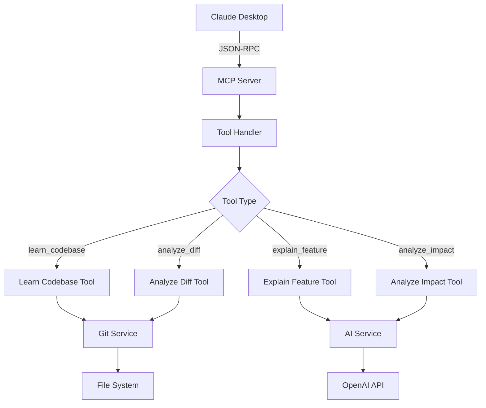

# 개발 가이드 (Development Guide)

## 📋 개발 환경 설정

### 필수 요구사항

- **Node.js**: 18.0.0 이상
- **npm**: 9.0.0 이상 (Node.js와 함께 설치됨)
- **TypeScript**: 5.3.3 이상 (프로젝트에 포함됨)
- **Git**: 버전 관리용

### 개발 도구 설정

#### 1. VS Code 추천 확장 프로그램

```json
{
  "recommendations": [
    "ms-vscode.vscode-typescript-next",
    "esbenp.prettier-vscode",
    "ms-vscode.vscode-eslint",
    "bradlc.vscode-tailwindcss",
    "ms-vscode.vscode-json"
  ]
}
```

#### 2. 환경 변수 설정

`.env` 파일을 프로젝트 루트에 생성:

```env
# MCP 서버 설정
MCP_SERVER_NAME=code-ai-mcp-node
MCP_SERVER_VERSION=1.0.0
NODE_ENV=development

# AI 통합
OPENAI_API_KEY=your_openai_api_key_here
OPENAI_MODEL=gpt-4

# Git 설정
DEFAULT_BRANCH=main
MAX_FILE_SIZE=1048576

# 로깅
LOG_LEVEL=debug
```

## 🏗️ 아키텍처 개요

### 프로젝트 구조

```
src/
├── server.ts                 # MCP 서버 메인 엔트리포인트
├── types/                    # TypeScript 타입 정의
│   ├── mcp.ts               # MCP 관련 타입
│   ├── git.ts               # Git 관련 타입
│   └── analysis.ts          # 분석 결과 타입
├── tools/                    # MCP 도구 구현
│   ├── learn-codebase.ts    # 코드베이스 학습 도구
│   ├── analyze-diff.ts      # 브랜치 차이 분석 도구
│   ├── explain-feature.ts   # 기능 설명 도구
│   └── analyze-impact.ts    # 영향도 분석 도구
├── services/                 # 비즈니스 로직 서비스
│   ├── git.service.ts       # Git 작업 서비스
│   ├── analysis.service.ts  # 코드 분석 서비스
│   └── ai.service.ts        # AI 통합 서비스
├── utils/                    # 유틸리티 함수
│   ├── file-utils.ts        # 파일 작업 유틸리티
│   ├── logger.ts            # 로깅 유틸리티
│   └── error-handler.ts     # 에러 핸들링
└── config/                   # 설정 관리
    ├── mcp-config.ts        # MCP 설정
    └── app-config.ts        # 애플리케이션 설정
```

### MCP 서버 플로우



## 🛠️ 개발 워크플로우

### 1. 새로운 도구 추가

#### Step 1: 타입 정의

`src/types/` 폴더에 도구별 타입 정의:

```typescript
// src/types/new-tool.ts
export interface NewToolParams {
  inputParam: string;
  optionalParam?: boolean;
}

export interface NewToolResult {
  result: string;
  metadata: {
    timestamp: string;
    duration: number;
  };
}
```

#### Step 2: 도구 구현

`src/tools/` 폴더에 도구 구현:

```typescript
// src/tools/new-tool.ts
import { CallToolRequestSchema } from '@modelcontextprotocol/sdk/types.js';
import { NewToolParams, NewToolResult } from '../types/new-tool.js';

export async function handleNewTool(
  params: NewToolParams
): Promise<NewToolResult> {
  // 도구 로직 구현
  return {
    result: "처리 결과",
    metadata: {
      timestamp: new Date().toISOString(),
      duration: Date.now() - startTime
    }
  };
}
```

#### Step 3: 서버에 등록

`src/server.ts`에서 도구 등록:

```typescript
// tools/list 핸들러에 도구 추가
server.setRequestHandler(ListToolsRequestSchema, async () => ({
  tools: [
    // ... 기존 도구들
    {
      name: 'new_tool',
      description: '새로운 도구의 설명',
      inputSchema: {
        type: 'object',
        properties: {
          inputParam: { type: 'string' },
          optionalParam: { type: 'boolean' }
        },
        required: ['inputParam']
      }
    }
  ]
}));

// tools/call 핸들러에 케이스 추가
server.setRequestHandler(CallToolRequestSchema, async (request) => {
  switch (request.params.name) {
    // ... 기존 케이스들
    case 'new_tool':
      return await handleNewTool(request.params.arguments as NewToolParams);
  }
});
```

### 2. 테스트 작성

#### 단위 테스트

`src/__tests__/tools/` 폴더에 테스트 파일:

```typescript
// src/__tests__/tools/new-tool.test.ts
import { describe, it, expect } from 'vitest';
import { handleNewTool } from '../../tools/new-tool.js';

describe('NewTool', () => {
  it('should return expected result', async () => {
    const params = { inputParam: 'test' };
    const result = await handleNewTool(params);
    
    expect(result.result).toBe('처리 결과');
    expect(result.metadata.timestamp).toBeDefined();
  });
});
```

#### 통합 테스트

```bash
# MCP 서버 수동 테스트
npm run dev &
echo '{"jsonrpc":"2.0","id":1,"method":"tools/list"}' | node -e "
const data = JSON.parse(require('fs').readFileSync(0, 'utf8'));
console.log(JSON.stringify(data));
"
```

### 3. 코드 품질 관리

#### ESLint 설정

```json
// .eslintrc.json
{
  "extends": [
    "@typescript-eslint/recommended",
    "@typescript-eslint/recommended-requiring-type-checking"
  ],
  "parser": "@typescript-eslint/parser",
  "parserOptions": {
    "project": "./tsconfig.json"
  },
  "rules": {
    "@typescript-eslint/no-unused-vars": "error",
    "@typescript-eslint/explicit-function-return-type": "warn"
  }
}
```

#### Prettier 설정

```json
// .prettierrc
{
  "semi": true,
  "trailingComma": "es5",
  "singleQuote": true,
  "printWidth": 80,
  "tabWidth": 2
}
```

## 🐛 디버깅 가이드

### 1. MCP 프로토콜 디버깅

#### STDIO 통신 로깅

```typescript
// src/utils/debug.ts
export function logMCPMessage(direction: 'in' | 'out', message: any) {
  if (process.env.NODE_ENV === 'development') {
    console.error(`[MCP ${direction.toUpperCase()}]`, JSON.stringify(message));
  }
}
```

#### Claude Desktop 연결 테스트

```bash
# 서버 수동 테스트 스크립트
#!/bin/bash
cd code-ai-mcp-node

# 서버 시작
npm run dev &
SERVER_PID=$!

# 테스트 메시지 전송
echo '{"jsonrpc":"2.0","id":1,"method":"initialize","params":{"protocolVersion":"2024-11-05","capabilities":{},"clientInfo":{"name":"test-client","version":"1.0.0"}}}' | node dist/server.js

# 서버 종료
kill $SERVER_PID
```

### 2. 일반적인 문제 해결

#### 문제: "Server transport closed unexpectedly"

**원인**: STDIO 출력에 로그가 섞임
**해결**: 로그를 stderr로 출력하도록 변경

```typescript
// 잘못된 예
console.log('Debug message');

// 올바른 예  
console.error('Debug message');
```

#### 문제: "Tool not found"

**원인**: 도구 이름 불일치
**해결**: tools/list와 tools/call에서 동일한 이름 사용 확인

## 📊 성능 최적화

### 1. 메모리 사용량 최적화

- 대용량 파일은 스트림 처리
- 불필요한 객체 참조 제거
- 가비지 컬렉션 최적화

### 2. 응답 시간 최적화

- 파일 읽기 병렬 처리
- 캐싱 활용
- 불필요한 await 제거

### 3. 모니터링

```typescript
// src/utils/performance.ts
export function measureExecutionTime<T>(
  fn: () => Promise<T>
): Promise<{ result: T; duration: number }> {
  const start = Date.now();
  return fn().then(result => ({
    result,
    duration: Date.now() - start
  }));
}
```

## 🚀 배포 가이드

### 1. 빌드

```bash
# TypeScript 컴파일
npm run build

# 빌드 결과 확인
ls -la dist/
```

### 2. Claude Desktop 설정

```json
{
  "mcpServers": {
    "code-ai-mcp": {
      "command": "node",
      "args": ["/absolute/path/to/code-ai-mcp-node/dist/server.js"],
      "env": {
        "NODE_ENV": "production"
      }
    }
  }
}
```

### 3. 프로덕션 최적화

- `NODE_ENV=production` 설정
- 로그 레벨 조정
- 불필요한 devDependencies 제거