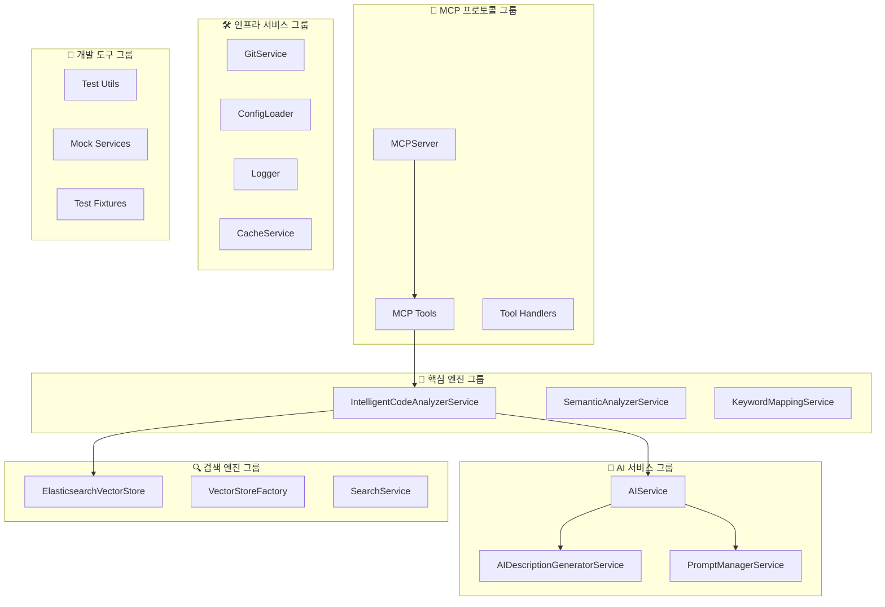

# 🧩 컴포넌트 개요 및 기능 그룹

> 지능형 코드 검색 시스템의 주요 컴포넌트들을 기능별로 분류하고 개발자가 쉽게 이해할 수 있도록 정리

## 📋 목차

1. [기능별 컴포넌트 맵](#-기능별-컴포넌트-맵)
2. [핵심 엔진 그룹](#-핵심-엔진-그룹)
3. [AI 서비스 그룹](#-ai-서비스-그룹)
4. [검색 엔진 그룹](#-검색-엔진-그룹)
5. [MCP 프로토콜 그룹](#-mcp-프로토콜-그룹)
6. [인프라 서비스 그룹](#-인프라-서비스-그룹)
7. [개발 도구 그룹](#-개발-도구-그룹)

## 🗺️ 기능별 컴포넌트 맵

### 전체 시스템 구성



## 🧠 핵심 엔진 그룹

### 주요 컴포넌트

| 컴포넌트 | 위치 | 역할 | 핵심 기능 |
|---------|------|------|-----------|
| **IntelligentCodeAnalyzerService** | `services/intelligent-code-analyzer.service.ts` | 🎯 메인 분석 엔진 | 코드베이스 분석, 검색 오케스트레이션 |
| **SemanticAnalyzerService** | `services/semantic-analyzer.service.ts` | 📊 의미 분석기 | AST 파싱, 코드 구조 분석 |
| **KeywordMappingService** | `services/keyword-mapping.service.ts` | 🗣️ 키워드 매퍼 | 한국어↔영어 매핑, 도메인 분류 |

### IntelligentCodeAnalyzerService 🎯

```typescript
/**
 * 🧠 지능형 코드 분석 서비스 - 시스템의 심장부
 *
 * @핵심책임
 * 1. 코드베이스 전체 스캔 및 분석
 * 2. AI 기반 메타데이터 생성 오케스트레이션
 * 3. 하이브리드 검색 기능 제공
 * 4. 진행 상황 실시간 추적
 */
class IntelligentCodeAnalyzerService {
  // 의존성 구성 - 각각 전문 영역을 담당
  private readonly semanticAnalyzer: SemanticAnalyzerService;    // 코드 구조 분석
  private readonly aiGenerator: AIDescriptionGeneratorService;   // AI 설명 생성
  private readonly keywordMapper: KeywordMappingService;         // 키워드 처리
  private readonly vectorStore: ElasticsearchVectorStore;        // 데이터 저장

  // 🔧 핵심 워크플로우
  async analyzeCodebase(request: CodeAnalysisRequest): Promise<CodeAnalysisResult> {
    // 1️⃣ 파일 스캔: 분석 대상 파일들을 탐지
    // 2️⃣ 구조 분석: AST를 통한 코드 요소 추출
    // 3️⃣ AI 분석: 각 요소에 대한 설명과 키워드 생성
    // 4️⃣ 인덱싱: 검색 가능한 형태로 저장
    // 5️⃣ 통계 생성: 분석 결과 요약
  }

  async searchCode(options: SearchOptions): Promise<EnhancedSearchResult> {
    // 🔍 하이브리드 검색 실행
    // - 자연어 쿼리 확장
    // - 벡터 유사도 + 키워드 매칭
    // - 결과 랭킹 및 필터링
  }

  // 🎯 특화 검색 기능들
  async exploreByDomain(domain: string): Promise<SearchResult[]>      // 도메인별 탐색
  async findSimilarCode(elementId: string): Promise<SearchResult[]>   // 유사 코드 검색
}
```

**사용 패턴**:
```typescript
// 기본 사용
const analyzer = new IntelligentCodeAnalyzerService(aiService, vectorStore);
await analyzer.initialize();

// 코드베이스 분석
const result = await analyzer.analyzeCodebase({
  repositoryPath: '/project/path',
  generateDescriptions: true,
  onProgress: (progress) => console.log(`${progress.percentage}% 완료`)
});

// 자연어 검색
const searchResults = await analyzer.searchCode({
  query: '사용자 인증 처리',
  size: 10
});
```

### SemanticAnalyzerService 📊

```typescript
/**
 * 📊 의미 분석 서비스 - 코드 구조의 이해
 *
 * @전문영역
 * - TypeScript/JavaScript AST 파싱
 * - 코드 요소 (클래스, 함수, 변수) 추출
 * - 구조적 메타데이터 생성
 * - 의존성 관계 파악
 */
class SemanticAnalyzerService {
  async analyzeFile(filePath: string, content: string): Promise<SemanticMetadata[]> {
    // 🌳 AST 파싱을 통한 코드 구조 분석
    // - 클래스, 함수, 변수, 인터페이스 등 추출
    // - 각 요소의 위치 정보 (라인 번호) 기록
    // - 기본적인 복잡도 측정
    // - 타입 정보 수집 (TypeScript의 경우)
  }

  private extractElements(ast: any): CodeElement[] {
    // 코드 요소별 추출 로직
    // - Classes: constructor, methods, properties
    // - Functions: parameters, return type, body
    // - Variables: type, initialization
    // - Imports/Exports: 의존성 관계
  }
}
```

**지원 언어 및 기능**:
- ✅ **TypeScript**: 완전 지원 (타입 정보 포함)
- ✅ **JavaScript**: 기본 지원
- ✅ **JSX/TSX**: React 컴포넌트 분석
- 🔄 **확장 예정**: Python, Java, Go

### KeywordMappingService 🗣️

```typescript
/**
 * 🗣️ 키워드 매핑 서비스 - 다국어 검색의 핵심
 *
 * @특화기능
 * - 한국어 ↔ 영어 키워드 자동 매핑
 * - 도메인별 용어 분류 (authentication, user, payment 등)
 * - 동의어 및 유사어 확장
 * - 검색 쿼리 최적화
 */
class KeywordMappingService {
  // 🗂️ 내장 키워드 데이터베이스
  private readonly domainMappings = {
    authentication: {
      korean: ['인증', '로그인', '로그아웃', '사용자'],
      english: ['auth', 'login', 'logout', 'user', 'credential'],
      synonyms: ['signin', 'signout', 'authenticate', 'authorize']
    },
    user: {
      korean: ['사용자', '유저', '회원', '계정'],
      english: ['user', 'member', 'account', 'profile'],
      synonyms: ['customer', 'client', 'person']
    }
    // ... 더 많은 도메인
  };

  expandSearchQuery(query: string): QueryExpansion {
    // 🔍 검색 쿼리 확장 알고리즘
    // 1. 원본 키워드 추출
    // 2. 한영 매핑 적용
    // 3. 동의어 추가
    // 4. 도메인별 관련 용어 추가
    // 5. 가중치 계산
  }

  classifyDomain(keywords: string[]): string {
    // 🏷️ 키워드 기반 도메인 자동 분류
    // - 키워드 빈도 분석
    // - 도메인별 점수 계산
    // - 최적 도메인 선택
  }
}
```

**매핑 예시**:
```typescript
// 입력: "사용자 로그인 처리"
const expansion = keywordMapper.expandSearchQuery('사용자 로그인 처리');

// 출력:
{
  originalQuery: '사용자 로그인 처리',
  expandedKeywords: [
    { keyword: '사용자', weight: 1.0 },
    { keyword: 'user', weight: 0.9 },
    { keyword: '로그인', weight: 1.0 },
    { keyword: 'login', weight: 0.9 },
    { keyword: 'auth', weight: 0.8 },
    { keyword: 'authentication', weight: 0.7 }
  ],
  synonyms: ['signin', 'authenticate', 'member'],
  relatedTerms: ['credential', 'session', 'token'],
  suggestedDomain: 'authentication'
}
```

## 🤖 AI 서비스 그룹

### 주요 컴포넌트

| 컴포넌트 | 위치 | 역할 | 사용 API |
|---------|------|------|----------|
| **AIService** | `services/ai.service.ts` | 🎯 AI 통합 허브 | OpenAI + Claude |
| **AIDescriptionGeneratorService** | `services/ai-description-generator.service.ts` | 📝 설명 생성기 | Claude Sonnet |
| **PromptManagerService** | `services/prompt-manager.service.ts` | 🎭 프롬프트 관리 | YAML 기반 |

### AIService 🤖

```typescript
/**
 * 🤖 AI 통합 서비스 - 모든 AI 기능의 중앙 허브
 *
 * @설계전략
 * - OpenAI: 임베딩 전담 (안정성과 성능)
 * - Claude: 텍스트 생성 전담 (한국어 지원, 코드 이해력)
 * - Mock 구현: 테스트와 개발 환경 지원
 */
class AIService implements IAIService {
  private openai: OpenAI;           // text-embedding-ada-002
  private anthropic: Anthropic;     // claude-3-5-sonnet

  // 🔢 임베딩 생성 (OpenAI)
  async generateEmbedding(text: string): Promise<number[]> {
    // 1536차원 벡터로 변환
    // 유사성 검색과 클러스터링에 사용
  }

  // 📊 코드 분석 (Claude)
  async analyzeCode(code: string, language: string): Promise<AnalysisResult> {
    // - 코드 복잡도 측정
    // - 컴포넌트 식별
    // - 의존성 분석
    // - 개선 제안
  }

  // 📝 코드 설명 (Claude)
  async explainCode(code: string, language: string): Promise<string> {
    // 자연스러운 한국어로 코드 동작 설명
    // 개발자가 이해하기 쉬운 형태로 변환
  }

  // 🛡️ 보안 분석 (Claude)
  async detectVulnerabilities(code: string): Promise<SecurityIssue[]> {
    // - SQL Injection, XSS 등 탐지
    // - 보안 권고사항 제공
    // - 수정 방안 제시
  }
}

// 🧪 테스트용 Mock 구현
class MockAIService implements IAIService {
  // 결정적 결과 반환 (API 호출 없음)
  // 빠른 테스트 실행과 개발 환경 지원
}
```

**API 조합의 이유**:
- **OpenAI 임베딩**: 업계 표준, 안정적 성능, 광범위한 지원
- **Claude 생성**: 뛰어난 한국어 지원, 자연스러운 설명, 코드 이해력

### AIDescriptionGeneratorService 📝

```typescript
/**
 * 📝 AI 설명 생성 서비스 - 코드를 자연어로
 *
 * @특화영역
 * - 코드 요소별 맞춤 설명 생성
 * - 한국어 우선 설명
 * - 목적과 사용법 포함
 * - 품질 검증 및 개선
 */
class AIDescriptionGeneratorService {
  async generateDescription(request: DescriptionRequest): Promise<DescriptionResult> {
    // 🎯 코드 요소별 맞춤 프롬프트 선택
    const prompt = this.promptManager.getPrompt(request.type, request.language);

    // 🤖 Claude를 통한 설명 생성
    const response = await this.aiService.explainCode(
      request.codeContext,
      request.language,
      prompt
    );

    // ✅ 품질 검증 및 후처리
    return this.validateAndEnhance(response, request);
  }

  private selectPromptStrategy(type: CodeElementType): string {
    // 요소 타입별 최적 프롬프트 선택
    // - Class: 역할과 책임 중심
    // - Function: 입출력과 동작 중심
    // - Interface: 계약과 용도 중심
  }
}
```

**생성 예시**:
```typescript
// 입력 코드
class UserAuthService {
  async login(username: string, password: string): Promise<AuthResult> {
    // 로그인 로직
  }
}

// 생성된 설명
{
  name: "UserAuthService",
  description: "사용자 인증과 로그인을 담당하는 서비스 클래스입니다.",
  purpose: "사용자의 로그인 요청을 처리하고 인증 결과를 반환합니다.",
  keywords: ["user", "authentication", "login", "사용자", "인증"],
  confidence: 0.92
}
```

### PromptManagerService 🎭

```typescript
/**
 * 🎭 프롬프트 관리 서비스 - AI 품질의 핵심
 *
 * @관리영역
 * - 프롬프트 템플릿 체계적 관리
 * - 언어별, 도메인별 최적화
 * - A/B 테스트 지원
 * - 성능 모니터링
 */
class PromptManagerService {
  // 📁 프롬프트 저장소 (YAML 파일 기반)
  private prompts: Map<string, PromptTemplate>;

  async loadPrompts(): Promise<void> {
    // YAML 파일에서 프롬프트 로드
    // - 코드 분석용 프롬프트
    // - 설명 생성용 프롬프트
    // - 보안 분석용 프롬프트
    // - 다국어 지원 프롬프트
  }

  getPrompt(type: PromptType, context: PromptContext): string {
    // 📋 컨텍스트별 최적 프롬프트 선택
    // - 코드 유형 (class, function, interface)
    // - 프로그래밍 언어
    // - 분석 목적 (설명, 보안, 리팩토링)
    // - 사용자 언어 선호도
  }
}
```

**프롬프트 구조**:
```yaml
# ai-prompts.yaml
analysis_prompts:
  class_analysis:
    korean:
      template: |
        다음 TypeScript 클래스를 분석하고 한국어로 설명해주세요:

        클래스명: {name}
        코드:
        ```typescript
        {codeContent}
        ```

        다음 항목들을 포함해주세요:
        1. 이 클래스의 주요 역할과 책임
        2. 제공하는 핵심 기능들
        3. 다른 컴포넌트와의 관계

      quality_check:
        min_length: 50
        max_length: 300
        required_keywords: ["클래스", "기능", "역할"]
```

## 🔍 검색 엔진 그룹

### 주요 컴포넌트

| 컴포넌트 | 위치 | 역할 | 기술 스택 |
|---------|------|------|-----------|
| **ElasticsearchVectorStore** | `services/elasticsearch.service.ts` | 🎯 벡터 스토어 | Elasticsearch + Dense Vector |
| **VectorStoreFactory** | `services/vector-store.service.ts` | 🏭 스토어 팩토리 | 추상화 레이어 |
| **VectorUtils** | `utils/vector-utils.ts` | 🔧 벡터 유틸 | 수학적 연산 |

### ElasticsearchVectorStore 🔍

```typescript
/**
 * 🔍 Elasticsearch 기반 벡터 스토어
 *
 * @핵심기능
 * - 고차원 벡터 저장 및 검색
 * - 하이브리드 검색 (벡터 + 텍스트)
 * - 메타데이터 기반 필터링
 * - 실시간 인덱싱
 */
class ElasticsearchVectorStore implements IVectorStore {
  // 🏗️ 인덱스 구조
  private readonly indexMapping = {
    properties: {
      content: { type: 'text' },                    // 원본 텍스트
      vector: {
        type: 'dense_vector',
        dims: 1536,                                 // OpenAI 임베딩 차원
        similarity: 'cosine'                        // 코사인 유사도
      },
      metadata: {
        properties: {
          filePath: { type: 'keyword' },
          language: { type: 'keyword' },
          elementType: { type: 'keyword' },
          domain: { type: 'keyword' },
          keywords: { type: 'text' }
        }
      }
    }
  };

  async search(query: SearchQuery): Promise<SearchResult[]> {
    // 🔍 하이브리드 검색 실행
    return this.client.search({
      index: this.indexName,
      body: {
        query: {
          bool: {
            should: [
              // 벡터 유사도 검색
              {
                script_score: {
                  query: { match_all: {} },
                  script: {
                    source: "cosineSimilarity(params.query_vector, 'vector')",
                    params: { query_vector: query.embedding }
                  }
                }
              },
              // 키워드 매칭
              {
                multi_match: {
                  query: query.text,
                  fields: ['content', 'metadata.keywords']
                }
              }
            ]
          }
        }
      }
    });
  }
}
```

**검색 성능 최적화**:
- **인덱스 샤딩**: 대용량 데이터 분산 처리
- **캐싱**: 자주 사용되는 쿼리 결과 캐싱
- **배치 인덱싱**: 대량 문서 효율적 처리

### 검색 알고리즘

```typescript
/**
 * 🎯 하이브리드 검색 알고리즘
 *
 * @조합전략
 * 1. 벡터 유사도 (70%): 의미적 유사성
 * 2. 키워드 매칭 (20%): 정확한 용어 매칭
 * 3. 메타데이터 (10%): 타입, 도메인 필터
 */
function calculateHybridScore(
  vectorScore: number,      // 0.0 - 1.0
  keywordScore: number,     // 0.0 - 1.0
  metadataScore: number     // 0.0 - 1.0
): number {
  return (
    vectorScore * 0.7 +
    keywordScore * 0.2 +
    metadataScore * 0.1
  );
}
```

## 🔗 MCP 프로토콜 그룹

### 주요 컴포넌트

| 컴포넌트 | 위치 | 역할 | 프로토콜 |
|---------|------|------|----------|
| **MCPServer** | `server/mcp-server.ts` | 🎯 프로토콜 서버 | JSON-RPC 2.0 |
| **Tool Handlers** | `tools/` | 🛠️ 기능 구현체 | MCP Tools API |
| **MCP Types** | `types/mcp.ts` | 📝 타입 정의 | Schema 정의 |

### MCPServer 🔗

```typescript
/**
 * 🔗 MCP 프로토콜 서버 - Claude Code 연결점
 *
 * @통신방식
 * - Transport: STDIO (표준 입출력)
 * - Protocol: JSON-RPC 2.0
 * - Encoding: UTF-8 JSON
 */
class MCPServer {
  // 🛠️ 등록된 도구들
  private readonly registeredTools = [
    {
      name: 'learn_codebase',
      description: '코드베이스를 분석하고 벡터 스토어에 인덱싱합니다',
      handler: handleLearnCodebase
    },
    {
      name: 'analyze_branch_diff',
      description: '브랜치 간 차이점을 분석하고 요약합니다',
      handler: handleAnalyzeDiff
    },
    {
      name: 'explain_feature',
      description: '특정 기능에 대한 상세 설명을 제공합니다',
      handler: handleExplainFeature
    },
    {
      name: 'analyze_impact',
      description: '코드 변경의 영향도를 분석합니다',
      handler: handleAnalyzeImpact
    }
  ];

  setupToolHandlers() {
    // 📋 도구 목록 조회 핸들러
    this.server.setRequestHandler(ListToolsRequestSchema, async () => {
      return { tools: this.getToolSchemas() };
    });

    // ⚡ 도구 실행 핸들러
    this.server.setRequestHandler(CallToolRequestSchema, async (request) => {
      const { name, arguments: args } = request.params;

      // 🔄 적절한 핸들러로 라우팅
      const handler = this.getToolHandler(name);
      return await handler(args);
    });
  }
}
```

### 도구별 핸들러들 🛠️

```typescript
// 📚 코드베이스 학습 도구
export async function handleLearnCodebase(args: LearnCodebaseInput): Promise<CallToolResult> {
  /**
   * 🔄 처리 워크플로우:
   * 1. 입력 검증 및 보안 체크
   * 2. 파일 시스템 스캔
   * 3. 코드 파일 필터링
   * 4. 청크 단위 분할
   * 5. AI 메타데이터 생성
   * 6. 벡터 인덱싱
   * 7. 진행 상황 보고
   */

  const stats = {
    totalFiles: 0,
    processedFiles: 0,
    totalChunks: 0,
    errors: 0
  };

  // 실시간 진행률 업데이트
  const progressReporter = (progress: number) => {
    console.error(`Processing: ${progress}% complete`);
  };

  return createSuccessResponse(stats);
}

// 🔄 브랜치 차이점 분석 도구
export async function handleAnalyzeDiff(args: AnalyzeDiffInput): Promise<CallToolResult> {
  /**
   * 🔍 Git diff 분석 과정:
   * 1. 브랜치 유효성 검증
   * 2. Git diff 추출
   * 3. 변경 파일별 분류
   * 4. 변경 타입 분석 (추가/수정/삭제)
   * 5. AI 기반 변경 요약 생성
   * 6. 영향도 평가
   */
}

// 💡 기능 설명 도구
export async function handleExplainFeature(args: ExplainFeatureInput): Promise<CallToolResult> {
  /**
   * 🎯 기능 설명 프로세스:
   * 1. 기능 식별자로 코드 검색
   * 2. 관련 코드 블록 수집
   * 3. 의존성 및 사용 예제 탐지
   * 4. AI 기반 상세 설명 생성
   * 5. 마크다운 형식으로 포매팅
   */
}

// 📈 영향도 분석 도구
export async function handleAnalyzeImpact(args: AnalyzeImpactInput): Promise<CallToolResult> {
  /**
   * 🕸️ 영향도 분석 알고리즘:
   * 1. 직접 영향 파일 분석
   * 2. 의존성 그래프 구축
   * 3. 전이적 영향 계산
   * 4. 위험도 등급 결정
   * 5. 테스트 대상 식별
   * 6. 권장사항 생성
   */
}
```

## 🛠️ 인프라 서비스 그룹

### 주요 컴포넌트

| 컴포넌트 | 위치 | 역할 | 기술 |
|---------|------|------|------|
| **GitService** | `services/git.service.ts` | 📂 Git 작업 | simple-git |
| **ConfigLoader** | `config/config-loader.ts` | ⚙️ 설정 관리 | dotenv + validation |
| **Logger** | `utils/logger.ts` | 📝 로깅 | 구조화 로깅 |
| **CacheService** | `decorators/cache.decorator.ts` | 💾 캐싱 | Redis + 메모리 |

### GitService 📂

```typescript
/**
 * 📂 Git 서비스 - 저장소 작업 전문
 *
 * @지원기능
 * - 브랜치 관리 및 전환
 * - Diff 추출 및 분석
 * - 파일 이력 추적
 * - 안전한 저장소 액세스
 */
class GitService {
  private git: SimpleGit;

  async getBranchDiff(
    repoPath: string,
    baseBranch: string,
    targetBranch: string
  ): Promise<DiffSummary> {
    // 🔍 브랜치 간 상세 diff 추출
    // - 파일별 변경 통계
    // - 추가/삭제된 라인 수
    // - 변경 타입 분류
    // - 바이너리 파일 감지
  }

  async getFileHistory(filePath: string): Promise<FileHistory[]> {
    // 📅 파일 변경 이력 추적
    // - 커밋 정보
    // - 변경 내용
    // - 작성자 정보
    // - 시간순 정렬
  }

  async validateRepository(repoPath: string): Promise<RepoValidation> {
    // ✅ 저장소 유효성 검증
    // - .git 디렉토리 존재 확인
    // - 접근 권한 검증
    // - 브랜치 존재 확인
  }
}
```

### Logger 📝

```typescript
/**
 * 📝 구조화 로깅 시스템
 *
 * @특징
 * - 컨텍스트 기반 로깅
 * - 성능 타이머 내장
 * - 에러 스택 트레이스
 * - 개발/프로덕션 모드 분리
 */
class StructuredLogger {
  withContext(context: string): ContextLogger {
    // 🏷️ 컨텍스트별 로거 생성
    // 모든 로그에 컨텍스트 정보 자동 포함
  }

  startTimer(label: string): TimerFunction {
    // ⏱️ 성능 측정 타이머
    const start = Date.now();
    return () => {
      const duration = Date.now() - start;
      this.info(`Timer: ${label}`, { duration });
    };
  }

  error(message: string, error: Error, metadata?: any): void {
    // 🚨 에러 로깅 with 스택 트레이스
    const logEntry = {
      level: 'error',
      message,
      error: {
        name: error.name,
        message: error.message,
        stack: error.stack
      },
      metadata,
      timestamp: new Date().toISOString()
    };
  }
}
```

## 🧪 개발 도구 그룹

### 테스트 인프라

| 컴포넌트 | 위치 | 역할 | 프레임워크 |
|---------|------|------|------------|
| **Unit Tests** | `__tests__/` | 🔬 단위 테스트 | Vitest |
| **Integration Tests** | `tests/acceptance/` | 🔗 통합 테스트 | Vitest |
| **Mock Services** | `services/*.mock.ts` | 🎭 모의 객체 | 커스텀 Mock |
| **Test Fixtures** | `test/fixtures/` | 📁 테스트 데이터 | 샘플 코드 |

### Mock 서비스 구현

```typescript
/**
 * 🎭 Mock AI Service - 테스트용 구현
 *
 * @설계원칙
 * - 결정적 동작: 동일 입력 → 동일 출력
 * - 빠른 실행: API 호출 없음
 * - 실제와 유사한 응답: 프로덕션 인터페이스 준수
 */
export class MockAIService implements IAIService {
  async generateEmbedding(text: string): Promise<number[]> {
    // 텍스트 길이 기반 결정적 벡터 생성
    const seed = text.length;
    return Array(1536).fill(0).map((_, i) =>
      Math.sin(seed + i) * 0.5 + 0.5
    );
  }

  async analyzeCode(code: string): Promise<AnalysisResult> {
    // 코드 길이 기반 복잡도 계산
    const complexity = Math.min(10, Math.max(1, Math.floor(code.length / 100)));

    return {
      summary: `Mock analysis of ${code.length} characters`,
      complexity,
      components: this.extractMockComponents(code),
      dependencies: []
    };
  }
}
```

### 테스트 구조

```typescript
// 🔬 단위 테스트 예시
describe('IntelligentCodeAnalyzerService', () => {
  let analyzer: IntelligentCodeAnalyzerService;
  let mockAI: MockAIService;
  let mockVectorStore: MockVectorStore;

  beforeEach(() => {
    mockAI = new MockAIService();
    mockVectorStore = new MockVectorStore();
    analyzer = new IntelligentCodeAnalyzerService(mockAI, mockVectorStore);
  });

  it('should analyze codebase successfully', async () => {
    const result = await analyzer.analyzeCodebase({
      repositoryPath: './test-fixtures/sample-repo',
      generateDescriptions: true
    });

    expect(result.success).toBe(true);
    expect(result.summary.filesProcessed).toBeGreaterThan(0);
  });
});

// 🔗 통합 테스트 예시
describe('MCP Server Integration', () => {
  let server: MCPServer;
  let transport: MockTransport;

  beforeAll(async () => {
    server = new MCPServer();
    transport = new MockTransport();
    await server.connect(transport);
  });

  it('should handle learn_codebase tool end-to-end', async () => {
    const request = {
      method: 'tools/call',
      params: {
        name: 'learn_codebase',
        arguments: {
          repoPath: './test-fixtures/typescript-project'
        }
      }
    };

    const response = await transport.sendRequest(request);

    expect(response.result.isError).toBe(false);
    expect(response.result.content[0].text).toContain('분석이 완료되었습니다');
  });
});
```

---

## 🎯 개발자를 위한 팁

### 1. 컴포넌트 선택 가이드

**새 기능 개발 시 참고할 컴포넌트**:
- 🧠 **코드 분석 기능**: `IntelligentCodeAnalyzerService` 확장
- 🔍 **검색 기능**: `ElasticsearchVectorStore` 커스터마이징
- 🤖 **AI 기능**: `AIService` 메서드 추가
- 🛠️ **MCP 도구**: `tools/` 디렉토리에 새 핸들러 추가

### 2. 디버깅 포인트

**주요 로깅 위치**:
- 📊 분석 진행: `IntelligentCodeAnalyzerService.analyzeCodebase()`
- 🔍 검색 쿼리: `ElasticsearchVectorStore.search()`
- 🤖 AI 호출: `AIService.analyzeCode()`
- 🔗 MCP 통신: `MCPServer.setupToolHandlers()`

### 3. 성능 모니터링

**중요한 메트릭들**:
- 분석 속도: 파일당 처리 시간
- 검색 성능: 쿼리 응답 시간
- AI API 사용량: 토큰 소비량
- 메모리 사용량: 대용량 프로젝트 처리 시

이 컴포넌트 구조를 이해하면 시스템의 각 부분이 어떻게 협력하여 지능형 코드 검색을 실현하는지 파악할 수 있습니다! 🚀