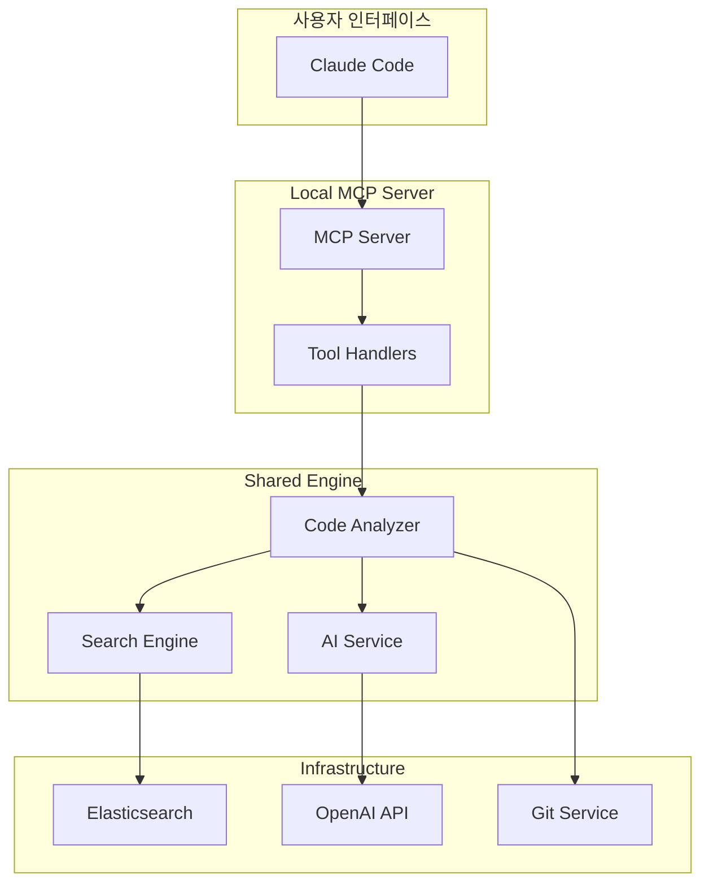

# 👨‍💻 개발자 온보딩 가이드

> 지능형 코드 검색 시스템 개발에 빠르게 적응할 수 있도록 도와주는 완전한 온보딩 가이드

## 📋 목차

1. [개발 환경 설정](#-개발-환경-설정)
2. [프로젝트 구조 이해](#-프로젝트-구조-이해)
3. [핵심 워크플로우](#-핵심-워크플로우)
4. [첫 번째 기여하기](#-첫-번째-기여하기)
5. [디버깅 및 문제 해결](#-디버깅-및-문제-해결)
6. [베스트 프랙티스](#-베스트-프랙티스)

## 🚀 개발 환경 설정

### 필수 요구사항

```bash
# 필수 도구 설치
node --version    # v22.0.0 이상
npm --version     # v10.x 이상
git --version     # v2.0 이상

# 선택적 도구
docker --version  # 18.0+ (Elasticsearch용)
```

### 1단계: 저장소 클론 및 설정

```bash
# 저장소 클론
git clone <repository-url>
cd code-ai-mcp-node

# 환경변수 설정
cp .env.example .env
# 필수: OPENAI_API_KEY 설정
# 선택: ANTHROPIC_API_KEY 설정

# 의존성 설치
npm install

# 전체 빌드
npm run build
```

### 2단계: 개발 서버 실행

```bash
# 터미널 1: 로컬 MCP 서버 (개발 모드)
npm run dev:local

# 터미널 2: AWS API 서버 (개발 모드)
npm run dev:aws

# 터미널 3: 테스트 실행
npm test
```

### 3단계: Elasticsearch 설정 (선택)

```bash
# Docker로 Elasticsearch 실행
docker-compose up elasticsearch -d

# 상태 확인
curl http://localhost:9200/_cluster/health
```

## 🏗️ 프로젝트 구조 이해

### 모노레포 구조 한눈에 보기

```
code-ai-mcp-node/
├── 📦 packages/
│   ├── shared/           # 🧠 핵심 지능형 검색 엔진
│   │   ├── services/     # 비즈니스 로직
│   │   ├── tools/        # MCP 도구들
│   │   ├── types/        # TypeScript 타입
│   │   └── utils/        # 유틸리티
│   │
│   ├── local-mcp/        # 🔗 Claude Code 연결점
│   │   └── src/index.ts  # MCP 서버 래퍼
│   │
│   └── aws-api/          # ☁️ 클라우드 API 서버
│       ├── grpc/         # gRPC 서버
│       ├── routes/       # REST API
│       └── services/     # 비즈니스 로직
│
├── 📊 tests/acceptance/  # 통합 테스트
├── 📚 docs/              # 문서
└── 🛠️ sh/               # 운영 스크립트
```

### 핵심 컴포넌트 관계도



## 🔄 핵심 워크플로우

### 1. 코드 분석 워크플로우

```typescript
// 📚 1단계: 코드베이스 학습
const analyzer = new IntelligentCodeAnalyzerService(aiService, vectorStore);
await analyzer.initialize();

const result = await analyzer.analyzeCodebase({
  repositoryPath: '/path/to/project',
  generateDescriptions: true,
  onProgress: (progress) => {
    console.log(`${progress.phase}: ${progress.percentage}%`);
  }
});

// 🔍 2단계: 자연어 검색
const searchResults = await analyzer.searchCode({
  query: '사용자 로그인 처리',
  size: 10
});

// 📊 3단계: 결과 활용
searchResults.results.forEach(result => {
  console.log(`📄 ${result.metadata.semanticMetadata?.name}`);
  console.log(`💡 ${result.metadata.semanticMetadata?.description}`);
});
```

### 2. MCP 도구 개발 워크플로우

```typescript
// 🛠️ 새 도구 추가 과정

// 1. 타입 정의 (types/mcp.ts)
export interface MyNewToolInput {
  param1: string;
  param2?: number;
}

// 2. 핸들러 구현 (tools/my-new-tool.ts)
export async function handleMyNewTool(args: MyNewToolInput): Promise<CallToolResult> {
  try {
    // 비즈니스 로직 구현
    const result = await processRequest(args);
    return createSuccessResponse(result);
  } catch (error) {
    return createErrorResponse(error);
  }
}

// 3. MCP 서버에 등록 (server/mcp-server.ts)
const tools: Tool[] = [
  // 기존 도구들...
  {
    name: 'my_new_tool',
    description: '새로운 도구의 설명',
    inputSchema: {
      type: 'object',
      properties: {
        param1: { type: 'string', description: '매개변수 설명' }
      },
      required: ['param1']
    }
  }
];

// 4. 라우터에 추가
switch (name) {
  case 'my_new_tool':
    result = await handleMyNewTool(args as MyNewToolInput);
    break;
}
```

### 3. AI 서비스 확장 워크플로우

```typescript
// 🤖 AI 기능 추가 과정

// 1. 인터페이스 확장 (domain/ports/outbound/index.ts)
interface IAIService {
  // 기존 메서드들...
  myNewAIFeature(input: string): Promise<MyResult>;
}

// 2. 구현체 추가 (services/ai.service.ts)
class AIService implements IAIService {
  async myNewAIFeature(input: string): Promise<MyResult> {
    const prompt = this.buildMyNewPrompt(input);

    const response = await this.anthropic.messages.create({
      model: 'claude-3-5-sonnet-20241022',
      messages: [{ role: 'user', content: prompt }],
      max_tokens: this.maxTokens
    });

    return this.parseMyResult(response);
  }
}

// 3. Mock 구현 추가 (테스트용)
class MockAIService implements IAIService {
  async myNewAIFeature(input: string): Promise<MyResult> {
    return {
      // 결정적 Mock 결과
      result: `Mock result for: ${input}`
    };
  }
}
```

## 🎯 첫 번째 기여하기

### 난이도별 기여 아이디어

#### 🟢 초급 (Good First Issues)

1. **문서 개선**
   ```markdown
   - README 예제 추가
   - JSDoc 주석 보완
   - 타입 정의 문서화
   ```

2. **테스트 추가**
   ```typescript
   // 단위 테스트 작성 예시
   describe('KeywordMappingService', () => {
     it('should expand Korean query correctly', () => {
       const mapper = new KeywordMappingService();
       const result = mapper.expandSearchQuery('사용자 로그인');

       expect(result.expandedKeywords).toContain('user');
       expect(result.expandedKeywords).toContain('login');
     });
   });
   ```

3. **로깅 개선**
   ```typescript
   // 더 상세한 로깅 추가
   this.logger.info('Starting code analysis', {
     repositoryPath,
     fileCount: files.length,
     estimatedTime: files.length * 0.1
   });
   ```

#### 🟡 중급

1. **새로운 검색 필터 추가**
   ```typescript
   interface SearchOptions {
     // 기존 옵션들...
     dateRange?: {
       from: Date;
       to: Date;
     };
     fileSize?: {
       min: number;
       max: number;
     };
   }
   ```

2. **성능 최적화**
   ```typescript
   // 배치 처리 개선
   async processBatch<T>(items: T[], batchSize: number, processor: (item: T) => Promise<void>) {
     for (let i = 0; i < items.length; i += batchSize) {
       const batch = items.slice(i, i + batchSize);
       await Promise.all(batch.map(processor));

       // 진행률 업데이트
       this.reportProgress(i + batch.length, items.length);
     }
   }
   ```

3. **새로운 프로그래밍 언어 지원**
   ```typescript
   // Python 파서 추가
   class PythonSemanticAnalyzer implements ISemanticAnalyzer {
     async analyzeFile(filePath: string, content: string): Promise<SemanticMetadata[]> {
       // Python AST 파싱 로직
     }
   }
   ```

#### 🔴 고급

1. **새로운 AI 모델 통합**
2. **분산 벡터 저장소 지원**
3. **실시간 코드 변경 감지**
4. **성능 모니터링 대시보드**

### 기여 프로세스

```bash
# 1. 브랜치 생성
git checkout -b feature/my-new-feature

# 2. 개발 및 테스트
npm test                    # 모든 테스트 실행
npm run lint               # 코드 스타일 검사
npm run build              # 빌드 확인

# 3. 커밋 (Conventional Commits)
git commit -m "feat: add new search filter for date range

- Add dateRange option to SearchOptions interface
- Implement date filtering in ElasticsearchVectorStore
- Add tests for date range filtering
- Update documentation

🤖 Generated with Claude Code"

# 4. 푸시 및 PR 생성
git push origin feature/my-new-feature
gh pr create --title "feat: add date range search filter"
```

## 🐛 디버깅 및 문제 해결

### 일반적인 문제들

#### 1. MCP 연결 문제

**증상**: Claude Code에서 도구가 인식되지 않음

**해결방법**:
```bash
# 1. 서버 로그 확인
npm run dev:local 2>&1 | grep -E "(error|ERROR)"

# 2. MCP 스키마 검증
node -e "
const server = require('./dist/packages/local-mcp/src/index.js');
console.log(JSON.stringify(server.tools, null, 2));
"

# 3. STDIO 통신 테스트
echo '{"jsonrpc":"2.0","id":1,"method":"tools/list"}' | node dist/packages/local-mcp/src/index.js
```

#### 2. AI API 문제

**증상**: AI 분석이 실패하거나 품질이 낮음

**해결방법**:
```typescript
// 1. API 키 확인
const aiService = new AIService();
try {
  const embedding = await aiService.generateEmbedding("test");
  console.log(`Embedding generated: ${embedding.length} dimensions`);
} catch (error) {
  console.error('API Key issue:', error);
}

// 2. 프롬프트 디버깅
const prompt = promptManager.getPrompt('class_analysis', { language: 'typescript' });
console.log('Generated prompt:', prompt);

// 3. Mock 서비스로 전환 (테스트용)
const mockAI = new MockAIService();
const analyzer = new IntelligentCodeAnalyzerService(mockAI, vectorStore);
```

#### 3. 검색 성능 문제

**증상**: 검색이 느리거나 결과가 부정확함

**해결방법**:
```bash
# 1. Elasticsearch 상태 확인
curl http://localhost:9200/_cluster/health
curl http://localhost:9200/_cat/indices

# 2. 인덱스 통계 확인
curl http://localhost:9200/codebase_index/_stats

# 3. 검색 쿼리 디버깅
curl -X POST "localhost:9200/codebase_index/_search" \
  -H "Content-Type: application/json" \
  -d '{"query":{"match_all":{}},"size":1}'
```

### 로깅 활용

```typescript
// 개발 시 유용한 로깅 패턴

// 1. 성능 측정
const timer = logger.startTimer('codebase-analysis');
await analyzer.analyzeCodebase(request);
timer(); // 자동으로 실행 시간 로깅

// 2. 상세 디버깅
logger.debug('Processing file', {
  filePath,
  fileSize: content.length,
  language: detectedLanguage,
  elementsFound: elements.length
});

// 3. 에러 컨텍스트
try {
  await riskyOperation();
} catch (error) {
  logger.error('Operation failed', error, {
    context: 'codebase-analysis',
    filePath,
    retryCount,
    timestamp: new Date().toISOString()
  });
}
```

## 🏆 베스트 프랙티스

### 코드 작성 가이드

#### 1. TypeScript 활용

```typescript
// ✅ 좋은 예시: 명확한 타입 정의
interface CodeAnalysisRequest {
  repositoryPath: string;
  includePatterns?: string[];
  excludePatterns?: string[];
  generateDescriptions?: boolean;
  onProgress?: (progress: AnalysisProgress) => void;
}

// ❌ 나쁜 예시: any 사용
function analyzeCode(data: any): any {
  return data.something;
}

// ✅ 좋은 예시: 타입 가드 활용
function isValidRepository(path: string): path is ValidRepositoryPath {
  return fs.existsSync(path) && fs.existsSync(path + '/.git');
}
```

#### 2. 에러 처리

```typescript
// ✅ 좋은 예시: 구조화된 에러 처리
class CodeAnalysisError extends Error {
  constructor(
    message: string,
    public readonly code: string,
    public readonly context?: Record<string, any>
  ) {
    super(message);
    this.name = 'CodeAnalysisError';
  }
}

async function analyzeFile(filePath: string): Promise<AnalysisResult> {
  try {
    const content = await fs.readFile(filePath, 'utf-8');
    return await processContent(content);
  } catch (error) {
    if (error.code === 'ENOENT') {
      throw new CodeAnalysisError(
        'File not found',
        'FILE_NOT_FOUND',
        { filePath }
      );
    }
    throw error;
  }
}
```

#### 3. 비동기 처리

```typescript
// ✅ 좋은 예시: Promise.all로 병렬 처리
async function processFiles(filePaths: string[]): Promise<ProcessResult[]> {
  const results = await Promise.all(
    filePaths.map(async (filePath) => {
      try {
        return await processFile(filePath);
      } catch (error) {
        logger.error(`Failed to process ${filePath}`, error);
        return null;
      }
    })
  );

  return results.filter((result): result is ProcessResult => result !== null);
}

// ❌ 나쁜 예시: 순차 처리
async function processFilesSequentially(filePaths: string[]): Promise<ProcessResult[]> {
  const results = [];
  for (const filePath of filePaths) {
    results.push(await processFile(filePath)); // 병목 발생
  }
  return results;
}
```

### 테스트 작성 가이드

#### 1. 단위 테스트

```typescript
// ✅ 좋은 테스트: AAA 패턴 (Arrange, Act, Assert)
describe('KeywordMappingService', () => {
  let service: KeywordMappingService;

  beforeEach(() => {
    // Arrange
    service = new KeywordMappingService();
  });

  it('should expand Korean query to include English keywords', () => {
    // Arrange
    const query = '사용자 인증';

    // Act
    const result = service.expandSearchQuery(query);

    // Assert
    expect(result.expandedKeywords).toEqual(
      expect.arrayContaining([
        expect.objectContaining({ keyword: 'user' }),
        expect.objectContaining({ keyword: 'authentication' })
      ])
    );
    expect(result.originalQuery).toBe(query);
  });
});
```

#### 2. 통합 테스트

```typescript
// ✅ 전체 워크플로우 테스트
describe('Code Analysis Integration', () => {
  let analyzer: IntelligentCodeAnalyzerService;
  let mockAI: MockAIService;
  let testRepo: string;

  beforeAll(async () => {
    // 테스트 환경 설정
    testRepo = './test-fixtures/sample-typescript-project';
    mockAI = new MockAIService();

    const vectorStore = new MemoryVectorStore();
    analyzer = new IntelligentCodeAnalyzerService(mockAI, vectorStore);
    await analyzer.initialize();
  });

  it('should complete full analysis workflow', async () => {
    const result = await analyzer.analyzeCodebase({
      repositoryPath: testRepo,
      generateDescriptions: true
    });

    expect(result.success).toBe(true);
    expect(result.summary.filesProcessed).toBeGreaterThan(0);

    // 검색도 테스트
    const searchResult = await analyzer.searchCode({
      query: 'function definition'
    });

    expect(searchResult.results.length).toBeGreaterThan(0);
  });
});
```

### 성능 고려사항

```typescript
// ✅ 메모리 효율적 스트리밍 처리
async function* processLargeFiles(filePaths: string[]) {
  for (const filePath of filePaths) {
    try {
      const content = await fs.readFile(filePath, 'utf-8');
      const processed = await processContent(content);
      yield processed;

      // 메모리 정리 힌트
      if (global.gc) global.gc();
    } catch (error) {
      logger.warn(`Skipping ${filePath}: ${error.message}`);
    }
  }
}

// 사용
for await (const result of processLargeFiles(filePaths)) {
  await indexResult(result);
  reportProgress();
}
```

## 📚 추가 학습 리소스

### 필수 읽기 자료

1. **아키텍처 문서**
   - [🏗️ 코드 아키텍처](../reference/code-architecture.md)
   - [🧩 컴포넌트 개요](./component-overview.md)

2. **기능별 가이드**
   - [🧠 지능형 검색 사용법](./intelligent-search.md)
   - [🤖 AI 기반 분석](./ai-analysis.md)

3. **기술 참조**
   - [📋 API 레퍼런스](../reference/api-reference.md)
   - [📡 MCP 프로토콜](../reference/mcp-protocol.md)

### 외부 리소스

- **MCP 프로토콜**: [Model Context Protocol Specification](https://modelcontextprotocol.io/)
- **OpenAI API**: [OpenAI API Documentation](https://platform.openai.com/docs)
- **Claude API**: [Anthropic API Documentation](https://docs.anthropic.com/)
- **Elasticsearch**: [Elasticsearch Guide](https://www.elastic.co/guide/en/elasticsearch/reference/current/index.html)

---

## 🎉 환영합니다!

이제 지능형 코드 검색 시스템 개발에 필요한 모든 기본 지식을 갖추셨습니다.

**다음 단계**:
1. 개발 환경 설정 완료하기
2. 작은 기여부터 시작하기
3. 커뮤니티에 질문하고 피드백 받기
4. 점진적으로 더 큰 기능 개발하기

**지원 채널**:
- 📢 **GitHub Issues**: 버그 리포트, 기능 요청
- 💬 **GitHub Discussions**: 질문, 아이디어 공유
- 📧 **이메일**: 직접적인 문의사항

함께 더 스마트한 코드 검색 시스템을 만들어 나가요! 🚀