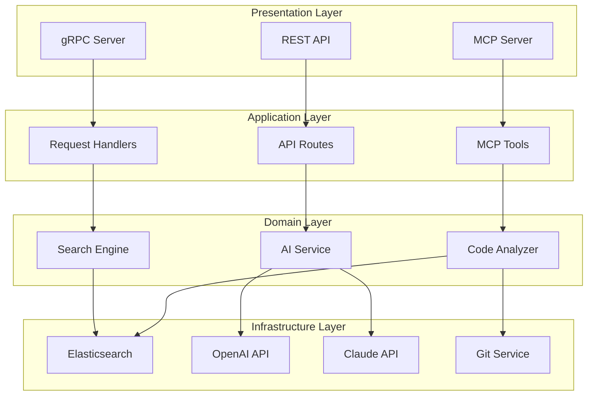

# 🏗️ 코드 아키텍처 가이드

> 지능형 코드 검색 시스템의 전체 아키텍처와 주요 컴포넌트에 대한 개발자 가이드

## 📋 목차

1. [전체 시스템 구조](#-전체-시스템-구조)
2. [헥사고날 아키텍처](#-헥사고날-아키텍처)
3. [패키지별 구조](#-패키지별-구조)
4. [핵심 컴포넌트](#-핵심-컴포넌트)
5. [데이터 흐름](#-데이터-흐름)
6. [디자인 패턴](#-디자인-패턴)

## 🌟 전체 시스템 구조

### 모노레포 구조

```
code-ai-mcp-node/
├── 📦 packages/
│   ├── shared/           # 🧠 핵심 지능형 검색 엔진
│   ├── local-mcp/        # 🔗 로컬 MCP 서버 (Claude Code 연결)
│   └── aws-api/          # ☁️ AWS API 서버 (gRPC + REST)
├── 📊 tests/             # 통합 테스트
├── 📚 docs/              # 통합 문서
└── 🛠️ sh/               # 운영 스크립트
```

### 아키텍처 레벨



## 🔷 헥사고날 아키텍처

### 포트 & 어댑터 패턴

```
                    Inbound Adapters (Primary)
        ┌─────────────────┬─────────────────┬─────────────────┐
        │   MCP Adapter   │   REST Adapter  │   gRPC Adapter  │
        │  (Claude Code)  │   (HTTP API)    │  (Internal RPC) │
        └─────────┬───────┴─────────┬───────┴─────────┬───────┘
                  │                 │                 │
            ┌─────▼─────────────────▼─────────────────▼─────┐
            │            Inbound Ports                      │
            │         (Primary Interfaces)                  │
            │                                               │
            │  • ICodeAnalyzer                             │
            │  • ISearchService                            │
            │  • IFeatureExplainer                         │
            │  • IImpactAnalyzer                           │
            │                                               │
            ├───────────────────────────────────────────────┤
            │                                               │
            │          🔷 Domain Core 🔷                   │
            │                                               │
            │    ┌─────────────────────────────────┐       │
            │    │      Application Services       │       │
            │    │   (Use Case Orchestrators)     │       │
            │    ├─────────────────────────────────┤       │
            │    │      Domain Entities            │       │
            │    │    (Business Objects)          │       │
            │    ├─────────────────────────────────┤       │
            │    │     Domain Services             │       │
            │    │   (Business Logic)              │       │
            │    └─────────────────────────────────┘       │
            │                                               │
            ├───────────────────────────────────────────────┤
            │           Outbound Ports                      │
            │        (Secondary Interfaces)                 │
            │                                               │
            │  • IAIService                                │
            │  • IVectorStore                              │
            │  • IGitRepository                            │
            │  • IConfigLoader                             │
            │                                               │
            └─────▲─────────────────▲─────────────────▲─────┘
                  │                 │                 │
        ┌─────────┴───────┬─────────┴───────┬─────────┴───────┐
        │ AI Service      │ Vector Store    │ Git Repository  │
        │ Adapter         │ Adapter         │ Adapter         │
        │ (OpenAI+Claude) │ (Elasticsearch) │ (simple-git)    │
        └─────────────────┴─────────────────┴─────────────────┘
                    Outbound Adapters (Secondary)
```

### 의존성 방향

```
High Level (Stable) ←── Low Level (Volatile)
      ↑                        ↑
Domain Core          Infrastructure/Adapters
```

## 📦 패키지별 구조

### 1. `packages/shared` - 핵심 엔진 🧠

```
src/
├── 🏛️ domain/                  # 도메인 레이어
│   ├── entities/               # 도메인 엔티티
│   ├── services/               # 도메인 서비스
│   ├── value-objects/          # 값 객체
│   └── ports/                  # 인터페이스 정의
│       ├── inbound/            # 주요 포트 (Use Cases)
│       └── outbound/           # 보조 포트 (Infrastructure)
│
├── 🔧 services/                # 애플리케이션 서비스
│   ├── intelligent-code-analyzer.service.ts    # 🎯 메인 분석 서비스
│   ├── ai.service.ts                          # 🤖 AI 통합 서비스
│   ├── elasticsearch.service.ts               # 🔍 벡터 스토어
│   ├── semantic-analyzer.service.ts           # 📊 의미 분석
│   ├── keyword-mapping.service.ts             # 🗣️ 키워드 매핑
│   ├── ai-description-generator.service.ts    # 📝 AI 설명 생성
│   ├── prompt-manager.service.ts              # 🎭 프롬프트 관리
│   ├── code-graph.service.ts                  # 🕸️ 코드 관계 그래프
│   └── git.service.ts                         # 📂 Git 작업
│
├── 🛠️ tools/                   # MCP 도구들
│   ├── learn-codebase.ts       # 📚 코드베이스 학습
│   ├── analyze-diff.ts         # 🔄 브랜치 비교
│   ├── explain-feature.ts      # 💡 기능 설명
│   └── analyze-impact.ts       # 📈 영향도 분석
│
├── 🌐 server/                  # MCP 서버
│   └── mcp-server.ts           # 서버 메인 클래스
│
├── 📝 types/                   # 타입 정의
│   ├── intelligent-search.ts   # 검색 관련 타입
│   ├── mcp.ts                  # MCP 프로토콜
│   ├── analysis.ts             # 분석 관련
│   ├── git.ts                  # Git 관련
│   ├── config.ts               # 설정
│   └── errors.ts               # 에러
│
├── 🔧 utils/                   # 유틸리티
│   ├── logger.ts               # 구조화 로깅
│   ├── vector-utils.ts         # 벡터 연산
│   ├── git-utils.ts            # Git 헬퍼
│   ├── ai-prompts.ts           # AI 프롬프트
│   └── mcp-formatter.ts        # MCP 응답 포매터
│
└── ⚙️ config/                  # 설정
    ├── app.config.ts           # 앱 설정
    ├── config-loader.ts        # 설정 로더
    └── env.schema.ts           # 환경변수 스키마
```

### 2. `packages/local-mcp` - 로컬 MCP 서버 🔗

```
src/
├── index.ts                    # 🚀 진입점 - MCP 서버 시작
└── index.test.ts               # 🧪 통합 테스트
```

**역할**: Claude Code와 직접 연결되는 MCP 서버 래퍼

### 3. `packages/aws-api` - 클라우드 API 서버 ☁️

```
src/
├── index.ts                    # 🚀 HTTP + gRPC 서버 진입점
├── grpc/                       # gRPC 서버
│   └── grpc.server.ts          # RPC 메서드 구현
├── routes/                     # REST API
│   ├── health.ts               # 헬스체크
│   └── analysis.ts             # 분석 API
└── services/                   # 비즈니스 로직
    ├── analysis.service.ts     # 분석 서비스
    └── storage.service.ts      # 저장소 서비스
```

**역할**: 확장 가능한 클라우드 API 및 내부 서비스 통신

## 🎯 핵심 컴포넌트

### 1. IntelligentCodeAnalyzerService 🧠
> **위치**: `packages/shared/src/services/intelligent-code-analyzer.service.ts`

```typescript
/**
 * 지능형 코드 분석 서비스 - 시스템의 핵심 엔진
 *
 * @responsibilities
 * - 코드베이스 전체 분석 및 인덱싱
 * - AI 기반 자연어 설명 생성
 * - 하이브리드 검색 (벡터 + 키워드)
 * - 도메인별 코드 분류
 */
class IntelligentCodeAnalyzerService {
  // 핵심 의존성들
  private readonly semanticAnalyzer: SemanticAnalyzerService;
  private readonly aiGenerator: AIDescriptionGeneratorService;
  private readonly keywordMapper: KeywordMappingService;
  private readonly vectorStore: ElasticsearchVectorStore;

  // 🔄 주요 워크플로우
  async analyzeCodebase(request: CodeAnalysisRequest): Promise<CodeAnalysisResult>
  async searchCode(options: SearchOptions): Promise<EnhancedSearchResult>
  async exploreByDomain(domain: string): Promise<SearchResult[]>
  async findSimilarCode(elementId: string): Promise<SearchResult[]>
}
```

**설계 철학**:
- **단일 책임**: 각 컴포넌트가 하나의 책임만 담당
- **의존성 주입**: 생성자를 통한 의존성 주입으로 테스트 용이성 확보
- **비동기 처리**: 대용량 코드베이스 처리를 위한 스트리밍 방식
- **진행 상황 추적**: `onProgress` 콜백을 통한 실시간 피드백

### 2. AIService 🤖
> **위치**: `packages/shared/src/services/ai.service.ts`

```typescript
/**
 * AI 통합 서비스 - OpenAI + Claude 조합
 *
 * @architecture
 * - OpenAI: 임베딩 생성 (text-embedding-ada-002)
 * - Claude: 코드 분석 및 설명 생성 (claude-3-5-sonnet)
 */
class AIService implements IAIService {
  // API 클라이언트들
  private openai: OpenAI;           // 임베딩 전용
  private anthropic: Anthropic;     // 텍스트 생성 전용

  // 🔧 핵심 기능들
  async generateEmbedding(text: string): Promise<number[]>
  async analyzeCode(code: string, language: string): Promise<AnalysisResult>
  async explainCode(code: string, language: string): Promise<string>
  async detectVulnerabilities(code: string): Promise<SecurityIssue[]>
  async suggestRefactoring(code: string): Promise<RefactoringSuggestion[]>
}

/**
 * Mock AI Service - 테스트용 구현체
 *
 * @benefits
 * - 빠른 테스트 실행 (API 호출 없음)
 * - 일관된 결과 (결정적 동작)
 * - 비용 절약 (API 요금 없음)
 */
class MockAIService implements IAIService {
  // 결정적 결과 반환 (텍스트 길이 기반 시드 사용)
}
```

**API 조합 전략**:
- **OpenAI**: 검증된 임베딩 모델, 안정적 성능
- **Claude**: 뛰어난 코드 이해력, 자연스러운 한국어 설명

### 3. MCPServer 🔗
> **위치**: `packages/shared/src/server/mcp-server.ts`

```typescript
/**
 * MCP 프로토콜 서버 - Claude Code 통신 담당
 *
 * @protocol JSON-RPC 2.0 over STDIO
 * @transport StdioServerTransport
 */
class MCPServer {
  private server: Server;

  // 🛠️ 등록된 도구들
  private tools = [
    'learn_codebase',      // 코드베이스 분석
    'analyze_branch_diff', // 브랜치 비교
    'explain_feature',     // 기능 설명
    'analyze_impact'       // 영향도 분석
  ];

  // 📡 요청 처리 흐름
  setupToolHandlers() {
    // Claude Code → JSON-RPC → Tool Handler → Domain Service → Response
  }
}
```

**통신 패턴**:
1. **도구 목록 조회**: `ListToolsRequestSchema`
2. **도구 실행**: `CallToolRequestSchema`
3. **에러 처리**: 구조화된 에러 응답
4. **진행 상황**: 실시간 진행률 업데이트

### 4. 도구별 핸들러 🛠️
> **위치**: `packages/shared/src/tools/`

각 도구는 특정한 분석 작업을 담당합니다:

```typescript
// 📚 learn-codebase.ts - 코드베이스 학습
export async function handleLearnCodebase(args: LearnCodebaseInput): Promise<CallToolResult> {
  // 1. 파일 스캔 및 필터링
  // 2. 코드 청크 분할
  // 3. AI 설명 생성
  // 4. 벡터 인덱싱
  // 5. 진행 상황 보고
}

// 🔄 analyze-diff.ts - 브랜치 비교
export async function handleAnalyzeDiff(args: AnalyzeDiffInput): Promise<CallToolResult> {
  // 1. Git diff 추출
  // 2. 변경사항 분석
  // 3. AI 기반 요약 생성
  // 4. 영향도 계산
}

// 💡 explain-feature.ts - 기능 설명
export async function handleExplainFeature(args: ExplainFeatureInput): Promise<CallToolResult> {
  // 1. 기능 코드 검색
  // 2. 관련 코드 수집
  // 3. AI 상세 설명 생성
  // 4. 사용 예제 추출
}

// 📈 analyze-impact.ts - 영향도 분석
export async function handleAnalyzeImpact(args: AnalyzeImpactInput): Promise<CallToolResult> {
  // 1. 의존성 그래프 구축
  // 2. 영향 범위 계산
  // 3. 위험도 평가
  // 4. 권장 사항 생성
}
```

## 🔄 데이터 흐름

### 1. 코드베이스 분석 플로우

```
📁 Repository
    ↓ (파일 스캔)
📄 Source Files
    ↓ (AST 파싱)
🌳 Code Elements
    ↓ (AI 분석)
🤖 Semantic Metadata
    ↓ (벡터화)
🔢 Embeddings
    ↓ (저장)
💾 Elasticsearch Index
```

### 2. 검색 플로우

```
🗣️ "사용자 로그인 처리"
    ↓ (키워드 확장)
🔍 ["user", "login", "authentication", "사용자", "인증"]
    ↓ (하이브리드 검색)
📊 Search Results
    ├─ 벡터 유사도 (의미적)
    ├─ 키워드 매칭 (정확성)
    └─ AI 메타데이터 (컨텍스트)
    ↓ (랭킹 & 필터링)
✨ Enhanced Results
```

### 3. MCP 통신 플로우

```
👨‍💻 Claude Code User
    ↓ (자연어 요청)
🤖 Claude Desktop
    ↓ (JSON-RPC)
🔗 MCP Server
    ↓ (도구 실행)
⚙️ Tool Handler
    ↓ (비즈니스 로직)
🧠 Domain Services
    ↓ (AI 분석)
🤖 AI APIs
    ↓ (결과 반환)
📋 Formatted Response
```

## 🎨 디자인 패턴

### 1. Hexagonal Architecture (포트 & 어댑터)
- **목적**: 비즈니스 로직과 외부 시스템 분리
- **구현**: 인터페이스 기반 의존성 주입
- **혜택**: 테스트 용이성, 확장성, 유지보수성

### 2. Strategy Pattern
```typescript
// AI 서비스 전략
interface IAIService {
  generateEmbedding(text: string): Promise<number[]>;
  analyzeCode(code: string): Promise<AnalysisResult>;
}

class AIService implements IAIService { /* 실제 구현 */ }
class MockAIService implements IAIService { /* 테스트 구현 */ }
```

### 3. Factory Pattern
```typescript
// 벡터 스토어 팩토리
class VectorStoreFactory {
  static createFromConfig(logger: Logger): IVectorStore {
    const config = ApplicationConfig.getVectorStoreConfig();

    switch (config.type) {
      case 'elasticsearch':
        return new ElasticsearchVectorStore(config, logger);
      case 'memory':
        return new MemoryVectorStore(config);
      default:
        throw new Error(`Unsupported vector store: ${config.type}`);
    }
  }
}
```

### 4. Decorator Pattern
```typescript
// 캐싱 데코레이터
class CachedAIService implements IAIService {
  constructor(
    private aiService: IAIService,
    private cache: ICache
  ) {}

  @Cacheable(CacheKeys.EMBEDDING, { ttl: 3600 })
  async generateEmbedding(text: string): Promise<number[]> {
    return this.aiService.generateEmbedding(text);
  }
}
```

### 5. Observer Pattern
```typescript
// 진행 상황 알림
interface ProgressObserver {
  onProgress(progress: AnalysisProgress): void;
}

class CodeAnalyzer {
  private observers: ProgressObserver[] = [];

  addObserver(observer: ProgressObserver): void {
    this.observers.push(observer);
  }

  private notifyProgress(progress: AnalysisProgress): void {
    this.observers.forEach(observer => observer.onProgress(progress));
  }
}
```

## 🧪 테스트 전략

### 1. 단위 테스트
```typescript
// Mock 기반 단위 테스트
describe('AIService', () => {
  let mockOpenAI: jest.Mocked<OpenAI>;
  let mockAnthropic: jest.Mocked<Anthropic>;

  beforeEach(() => {
    mockOpenAI = createMockOpenAI();
    mockAnthropic = createMockAnthropic();
  });

  it('should generate embeddings', async () => {
    const aiService = new AIService(mockOpenAI, mockAnthropic);
    const result = await aiService.generateEmbedding('test code');

    expect(result).toHaveLength(1536);
    expect(mockOpenAI.embeddings.create).toHaveBeenCalledWith({
      model: 'text-embedding-ada-002',
      input: 'test code'
    });
  });
});
```

### 2. 통합 테스트
```typescript
// 실제 API와의 통합 테스트
describe('Integration: IntelligentCodeAnalyzer', () => {
  let analyzer: IntelligentCodeAnalyzerService;

  beforeAll(async () => {
    analyzer = new IntelligentCodeAnalyzerService(
      new AIService(),
      new ElasticsearchVectorStore('test')
    );
    await analyzer.initialize();
  });

  it('should analyze codebase end-to-end', async () => {
    const result = await analyzer.analyzeCodebase({
      repositoryPath: './test-fixtures/sample-repo',
      generateDescriptions: true
    });

    expect(result.success).toBe(true);
    expect(result.summary.elementsAnalyzed).toBeGreaterThan(0);
  });
});
```

### 3. MCP 프로토콜 테스트
```typescript
// MCP 서버 통신 테스트
describe('MCP Server', () => {
  let server: MCPServer;
  let transport: MockTransport;

  beforeEach(async () => {
    server = new MCPServer();
    transport = new MockTransport();
    await server.start(transport);
  });

  it('should handle learn_codebase tool', async () => {
    const request = createCallToolRequest('learn_codebase', {
      repoPath: '/test/repo'
    });

    const response = await transport.sendRequest(request);

    expect(response.result.isError).toBe(false);
    expect(response.result.content).toContain('Analysis completed');
  });
});
```

## 📈 성능 고려사항

### 1. 메모리 관리
- **스트리밍**: 대용량 파일 청크 단위 처리
- **가비지 컬렉션**: 대용량 객체 즉시 정리
- **배치 처리**: API 호출 최소화

### 2. 동시성
- **비동기 처리**: Promise.all() 활용 병렬 처리
- **백프레셔**: 큐 기반 요청 제한
- **타임아웃**: 장시간 실행 방지

### 3. 캐싱
- **임베딩 캐싱**: 동일 텍스트 재사용
- **분석 결과 캐싱**: AI 분석 결과 저장
- **메타데이터 캐싱**: 파일 메타데이터 캐싱

## 🚀 확장성 설계

### 1. 수평 확장
- **마이크로서비스**: 기능별 서비스 분리 가능
- **로드 밸런싱**: API 서버 복제 지원
- **샤딩**: 벡터 스토어 분산 저장

### 2. 수직 확장
- **AI 모델 업그레이드**: 새 모델 쉽게 교체
- **검색 엔진 교체**: 인터페이스 기반 구현 교체
- **스토리지 확장**: 다양한 벡터 DB 지원

### 3. 기능 확장
- **새 도구 추가**: 플러그인 방식 도구 등록
- **언어 지원**: 새 프로그래밍 언어 추가
- **분석 타입**: 새 분석 방식 추가

---

이 아키텍처는 **확장성**, **유지보수성**, **테스트 용이성**을 중심으로 설계되었습니다. 각 컴포넌트는 명확한 책임을 가지고 있으며, 인터페이스를 통한 느슨한 결합으로 변경에 유연하게 대응할 수 있습니다.

🎯 **핵심 설계 원칙**: 단일 책임, 개방-폐쇄, 의존성 역전, 인터페이스 분리